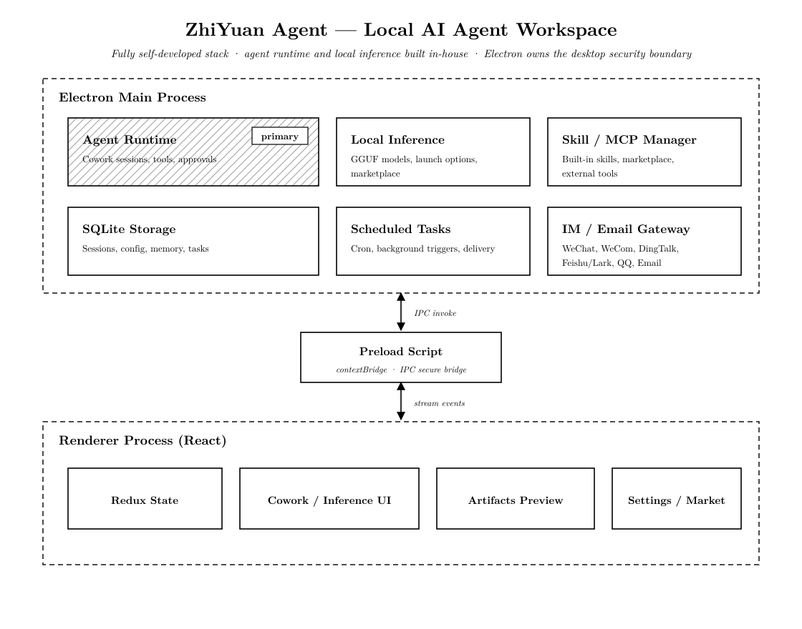

<p align="center">
  <picture>
    <source media="(prefers-color-scheme: dark)" srcset="public/zhiyuan-logo-dark-1600.png">
    
  </picture>
</p>

<h1 align="center">ZhiYuan Agent</h1>

<p align="center"><strong>Give AI a task. Get work done on your computer.</strong></p>
<p align="center">Open source · Local first · Files and browser tools · Local models · Reusable workflows</p>

<p align="center">
  <a href="https://www.rongxzyai.com/#download">Download</a> ·
  <a href="#get-started">Get started</a> ·
  <a href="#developer-quick-start">Develop locally</a> ·
  <a href="https://github.com/rongxinzy/RongxinAI/issues">Report an issue</a> ·
  <a href="README_zh.md">中文</a>
</p>

<p align="center">
  <a href="LICENSE"></a>
  <a href="https://github.com/rongxinzy/RongxinAI/actions/workflows/ci.yml"></a>
  <a href="https://github.com/rongxinzy/RongxinAI/stargazers"></a>
</p>

ZhiYuan Agent is a desktop AI workspace from Beijing Rongxin Zhiyuan, maintained by Li Keran. Use it to organize research, create documents, analyze spreadsheets, work on code, or run recurring tasks. The agent can read and write files, run commands, and operate a browser while showing messages, tool activity, and results.

<p align="center">
  
</p>
<p align="center"><sub>From a task description to a presentation, with visible progress and generated files.</sub></p>

## What you can do

| Task | Workflow |
| --- | --- |
| Research | Search the web, read local material, and organize findings with sources |
| Documents and data | Create presentations, work with Word, PDF, and Excel, and produce files from analysis |
| Code | Select a project directory, explore a repository, edit code, run commands, and inspect artifacts |
| Everyday work | Track work in Todos and schedule briefings, reports, and other recurring tasks |
| Browser tasks | Find information and operate web pages while following the agent's progress |
| Messaging | Connect WeChat, WeCom, DingTalk, Feishu/Lark, QQ, or email to use the agent through configured channels |

Experts provide presets for specific kinds of work. Skills package reusable methods and tools. MCP connects external services. Start with the bundled integrations and extend the workflows you need.

## Get started

1. Choose an installer for your system on the [official website](https://www.rongxzyai.com/#download). Release history and attached downloads are also available in [GitHub Releases](https://github.com/rongxinzy/RongxinAI/releases).
2. Open the app and start with the **built-in ZhiYuan free model**, without entering a third-party API key. You can also configure your own provider in model settings.
3. For local files or code, select a project directory, describe the task, and attach any relevant material.
4. Follow the progress, respond to approval requests, inspect the output, and continue with feedback.

The free model requires a network connection; availability and usage limits are shown in the app. The desktop project supports macOS, Windows, and Linux. Check the download page for available installers and architectures, or [run from source](#developer-quick-start).

### Use local models

Open the local inference workspace, browse the model marketplace, and choose a GGUF model and quantization suited to your hardware. Install the model and start its service. Adjust context length, GPU allocation, threads, and other options, then use a running local model for agent tasks.

Local models reduce reliance on cloud inference. Web search, model downloads, remote MCP services, and messaging channels still require their respective network services.

### Data and permissions

Sessions, configuration, and task metadata are stored locally. The desktop execution environment accesses local files. When you use a cloud model or remote tool, the content needed for that request is sent to the corresponding service.

Tool execution follows the selected permission mode. Operations requiring approval display a request; automatic authorization allows some operations to run directly. Progress and results remain visible in the workspace.

## Choose your workspace appearance

ZhiYuan includes **Codex**, **Daming Fenghua**, **Changan Fengwu**, and **Weiyang Jinshi** themes. Codex uses neutral surfaces and compact controls. Daming Fenghua combines paper white, cinnabar, and ink. Changan Fengwu adds silk white, peacock green, warm bronze, rounder controls, and a deep green night appearance. Weiyang Jinshi combines lacquer black, stone white, antique gold, and static cloud-scroll corner ornament.

In **Settings → Appearance**, select a theme preview card and choose light, dark, or system mode. Every card updates with the selected mode. Backgrounds, textures, typography, shapes, controls, and interaction states belong to the complete theme package.

<p align="center">
  <picture>
    <source media="(prefers-color-scheme: dark)" srcset="docs/theme-previews/appearance-settings-dark.png">
    
  </picture>
</p>

To create a theme, start with the [theme authoring guide](src/renderer/theme/README.md) and [design specification](DESIGN.md). Packages supply presentation data; shared components retain interaction and state ownership.

## Developer quick start

Install Git, Node.js **24.x**, and Bun **1.4.0**, as pinned in [`package.json`](package.json). Native dependencies may require Python and a C/C++ toolchain when prebuilt binaries are unavailable. See the [contributing guide](CONTRIBUTING.md) for Windows build requirements.

```bash
git clone https://github.com/rongxinzy/RongxinAI.git ZhiYuanAgent
cd ZhiYuanAgent
bun install
bun run electron:dev
```

The development command prepares the channel and memory runtimes, then starts Vite and Electron. Initial runtime preparation requires network access. To use local inference, download the inference runtime for your host separately:

```bash
bun run llamacpp:runtime:download
```

### Useful commands

| Command | Purpose |
| --- | --- |
| `bun run build` | Typecheck, build production assets, and verify runtime dependencies |
| `bun run test` | Run the project test script with native-module preparation and Electron dependency restoration |
| `bun run lint` | Check code, generated theme consistency, and style ownership |
| `bun run format:check` | Check formatting |
| `bun run test:bundle-budget` | Check the built renderer's bundle size |
| `bun run theme:generate` | Regenerate CSS after changing theme definitions |
| `bun run compile:electron` | Compile the Electron main process, including native dependency preparation |

Release packaging uses `bun run dist:mac`, `bun run dist:win`, or `bun run dist:linux`. These also involve platform runtimes, resources, and signing configuration; see [CONTRIBUTING.md](CONTRIBUTING.md) and [`package.json`](package.json).

### Project map

| Path | Responsibility |
| --- | --- |
| [`src/renderer`](src/renderer) | React workspace, conversations, settings, and local inference UI |
| [`src/shared`](src/shared) | Shared UI, types, and communication contracts |
| [`src/main`](src/main) | Desktop lifecycle, task execution, storage, and system services |
| [`src/main/preload.ts`](src/main/preload.ts) | Controlled IPC through `contextBridge` |
| [`src/renderer/theme`](src/renderer/theme) | Theme contracts, component appearance, backgrounds, and generation |
| [`SKILLs`](SKILLs) / [`MCPs`](MCPs) | Bundled skills and tool integrations |
| [`.github/workflows`](.github/workflows) | Tests, installer validation, and releases |

The stack includes Electron, React, TypeScript, Vite, Tailwind CSS, Redux Toolkit, and SQLite. Refer to [`package.json`](package.json) and [`bun.lock`](bun.lock) for dependency versions.

<details>
<summary>Desktop architecture</summary>

<p align="center">
  
</p>

The renderer owns the UI, preload provides the communication boundary, and the main process owns sessions, execution, data, and service lifecycles. Task messages, tool status, and approval requests stream back to the UI. Dedicated services manage local inference, skills, MCP, and messaging channels.

</details>

## Contribute

- [Report a bug](https://github.com/rongxinzy/RongxinAI/issues/new?template=bug_report.yml) with your system, app version, reproduction steps, and relevant logs.
- [Suggest a feature](https://github.com/rongxinzy/RongxinAI/issues/new?template=feature_request.yml) by describing the workflow and expected behavior.
- [Contribute code or documentation](CONTRIBUTING.md). Read [`AGENTS.md`](AGENTS.md) first and follow [`DESIGN.md`](DESIGN.md) for UI changes.

Star the repository to follow the project, or share a workflow you have built with ZhiYuan.

## Acknowledgments and license

Thanks to [AnySearch](https://github.com/anysearch-ai) for supporting the built-in web search capability. Its integration lives in [`SKILLs/web-search`](SKILLs/web-search).

ZhiYuan Agent is licensed under the [GNU Affero General Public License v3.0](LICENSE).
