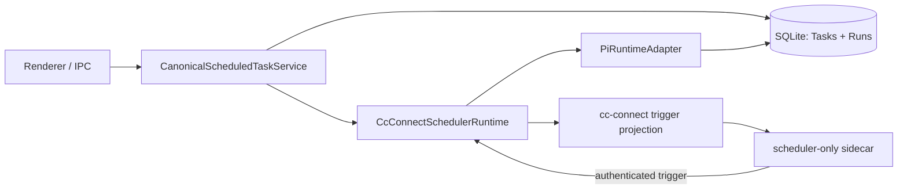

# 定时任务：Canonical Scheduler

## 目标

定时任务的定义、执行状态和审计记录全部由知远本地 SQLite 持有。`cc-connect` 是可丢弃的协议/时钟 sidecar，只能在到点时发送无负载 trigger；Pi 是唯一的 Agent 执行器。不存在旧调度系统的兼容或回退路径。



## 所有权与边界

| 部分 | 责任 | 明确不负责 |
| --- | --- | --- |
| `SqliteScheduledTaskStore` | Task、Run、去重 claim、崩溃恢复 | 时钟、Agent 执行 |
| `CcConnectSchedulerRuntime` | SQLite 与 trigger 投影的协调 | 持久化任务、解释 payload |
| `cc-connect` sidecar | `at` / `every` / `cron` 到点 trigger | shell/exec、Agent、任务状态、投递内容 |
| `PiScheduledTaskExecutor` | 创建/恢复 Pi 会话并执行 | 触发判定、任务持久化 |  

## 会话绑定策略

任务执行支持三种绑定方式：

1. `per-run`：每次触发创建新的 `Scheduled` 会话，适合互相独立的报告和提醒。
2. `task`：按任务 ID 创建一个稳定的专属会话，后续 Run 继续该会话；同一任务的执行在执行器内串行化。
3. `existing`：通过 `Main + zhiyuan:<sessionId>` 绑定已有 UI/IM 会话，运行结果追加到该会话。

三种方式都保留独立的 canonical Run 记录；会话是否复用不影响 Run 级审计、状态和投递记录。

## Trigger 契约

sidecar 向回环 bridge 发送：

```json
{
  "requestId": "...",
  "accountId": "__zhiyuan_scheduler__",
  "taskId": "...",
  "scheduleVersion": "sha256...",
  "scheduledAt": "2026-08-11T01:00:00.000Z"
}
```

`accountId` 必须是内部专用的 `__zhiyuan_scheduler__`。投递账号不参与时钟身份：它仅用于任务执行后的渠道/会话路由。Runtime 先校验时钟身份与 `scheduleVersion`，再以 `(taskId, scheduleVersion, scheduledAt)` 原子 claim Run；重复、过期或来自渠道 sidecar 的 trigger 不会执行 Pi。

## 进程恢复

1. 应用启动时，`recoverInterruptedRuns()` 将遗留 `running` Run 记为 error。
2. 默认 scheduler-only sidecar 在本地随机回环端口启动，控制面须通过 bridge token 的健康检查。
3. 健康检查成功后，从 SQLite 全量重协调 trigger 投影。sidecar 自身不保存任务状态。
4. sidecar 退出时解绑控制客户端，按指数退避重启；重新附着后再次全量重协调。
5. `at`、`every` 与 cron 的单任务 timer 在设备从休眠醒来后对已到期的等待补发一次；cron 随后按声明的时区计算下一次触发。

## 迁移

旧 `scheduled_tasks` / `scheduled_task_runs` 只导入 `zhiyuan_scheduled_tasks` / `zhiyuan_scheduled_task_runs`。迁移不写 Agent runtime，也不创建外部 JSONL 状态。旧的一次性 `at` 任务会保留在 SQLite，以便 UI 和审计可见。

## 验证重点

- 账号不匹配、版本陈旧和重复 trigger 都不创建新 Run。
- 关闭/重启 sidecar 后，SQLite 中启用任务会再次投影。
- Pi 成功、失败及进程中断都更新同一条 canonical Run。
- sidecar 控制 API 只接受 schedule 描述，拒绝未知字段、payload 和 exec。
